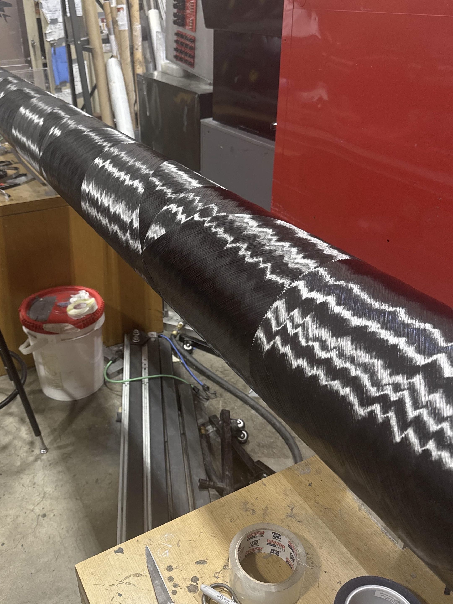
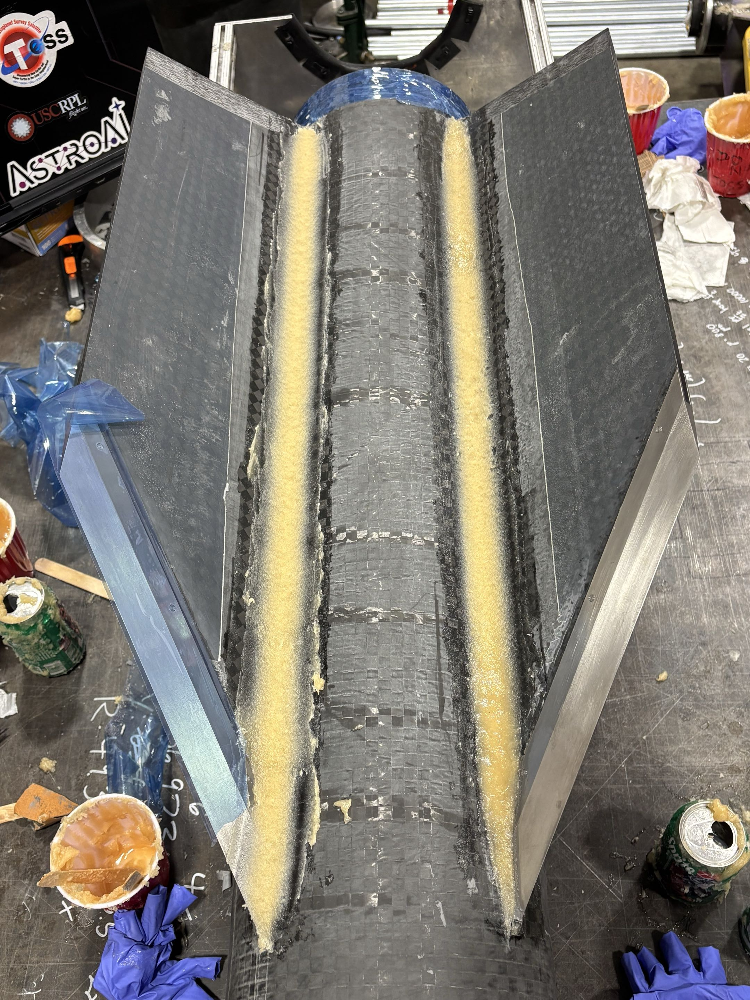
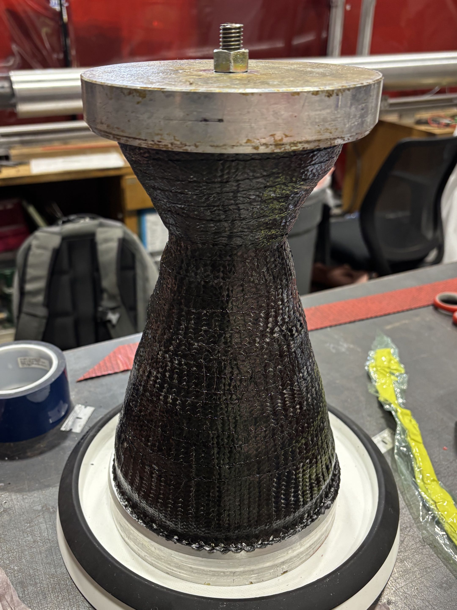
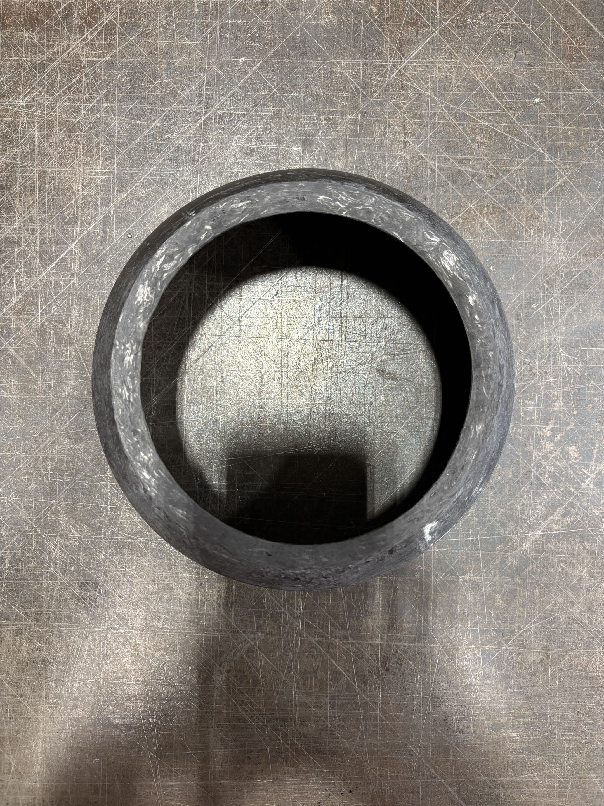
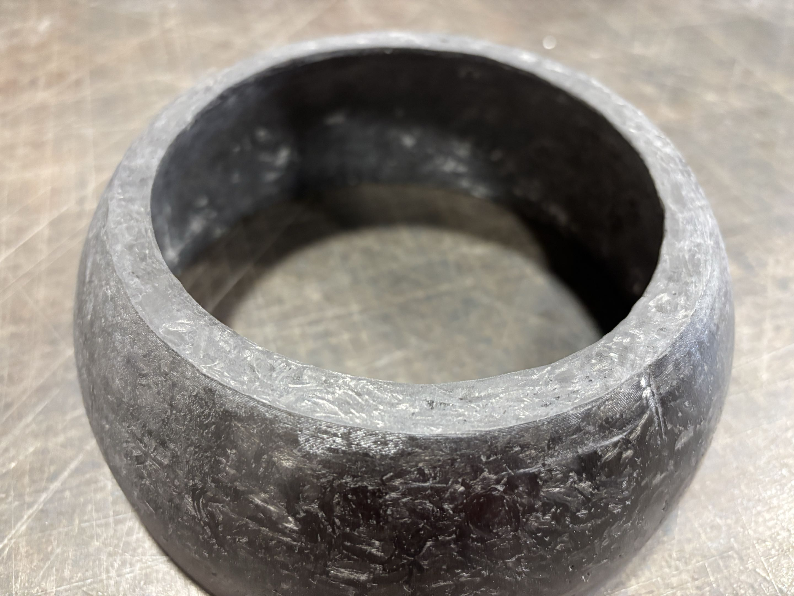
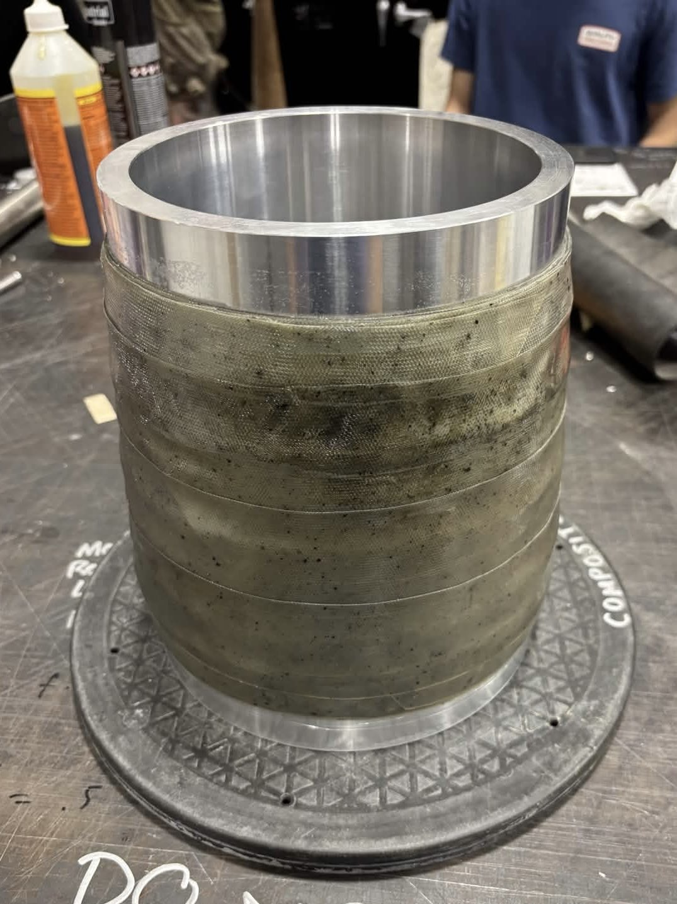
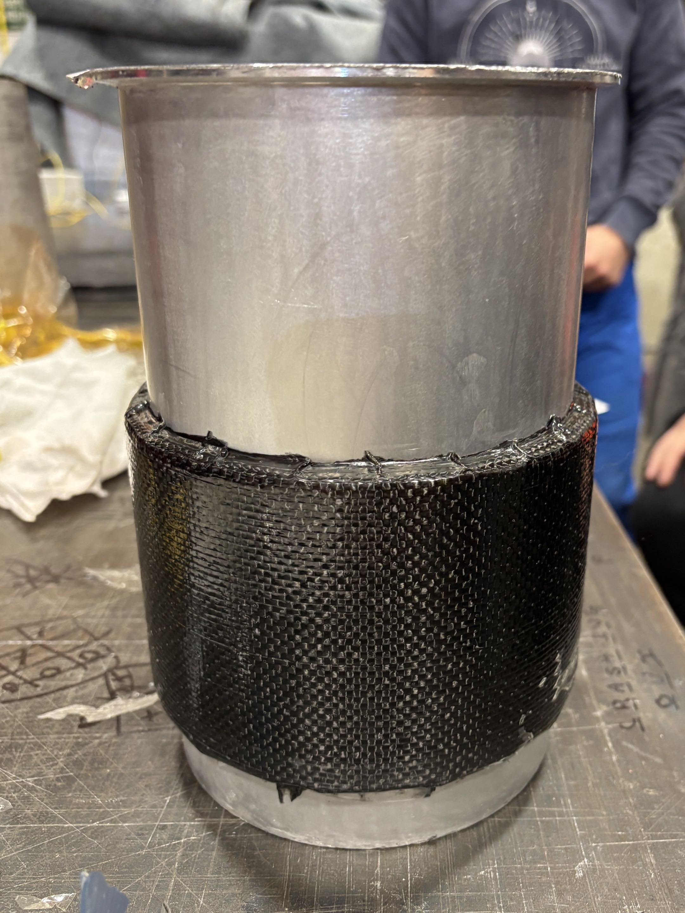

# Zoe Zlatic

Astronautical Engineering student at the University of Southern California (USC), CAD Lead at the USC Rocket Propulsion Laboratory (RPL), rocket intern at Firefly Aerospace.

---

## Projects

### Static Fire Layout File
Developed a parametrized Siemens NX layout for RPL's Baja Blast II static fire using a single master geometry sketch and expression-driven design architecture

### Composite Structure Layups
Manufactured and integrated composite structures for past and current RPL vehicles, including carbon epoxy cases, cork TPS nosecones, carbon fiber fins, honeycomb core fins, and carbon phenolic nozzles

### Zero-G Water Purification Experiment
Tested effects of Procter & Gamble's water purification powder in micro- and artificial gravity environments aboard Zero-G's plane through designing, building, testing, and revising an experiment over the course of nine months

---

## Skills

- CAD (Siemens NX)
- Composite Structures
- MATLAB
- Engineering Presentations
- Iterative Design
- Leadership

---

## Experience

- NASA High School Internship (x2)
- AGU Fall Meeting (x2)
- Zero-G Research Flight
- USC Rocket Propulsion Lab

---

## Contact

- [LinkedIn](www.linkedin.com/in/zoezlatic)
- [Email](zoe.zlatic@gmail.com)
